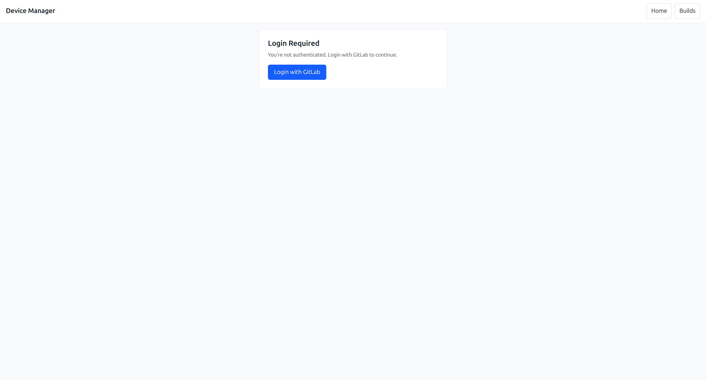
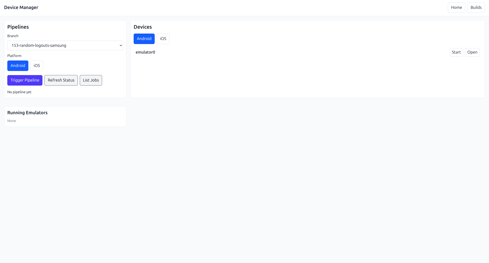
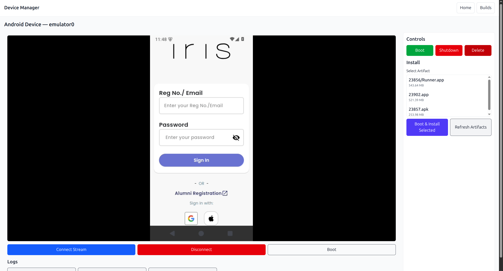
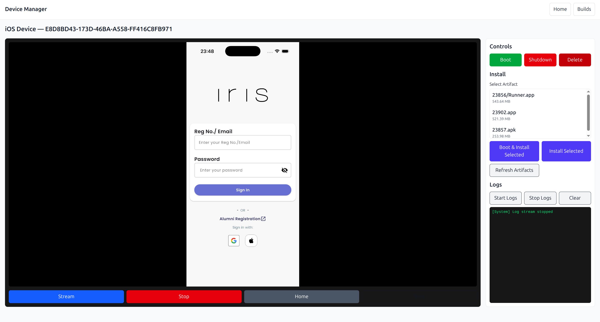
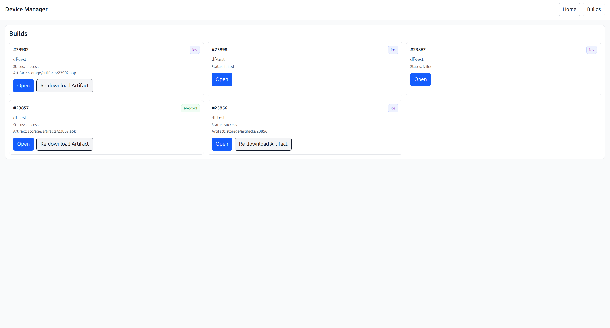

# Device Farm Manager

A device management solution for Android and iOS devices, integrated with GitLab for CI/CD pipelines. This project allows users to manage emulators/simulators, view device screens remotely, trigger builds, and access build artifacts directly from a web interface.


## Flow

1.  **User Authentication**: Users log in via GitLab OAuth. The backend validates the token and establishes a session.
    
    

2.  **Device Selection**: The Home page lists available Android AVDs and iOS Simulators. Users can boot a device or connect to an already running one.

3.  **Device Interaction**:
    *   **Android**: The backend uses `scrcpy` to capture the screen and streams it to the frontend via WebSocket. User inputs (clicks, swipes) are sent back to the device.
    *   **iOS**: The backend streams the simulator screen using `xcrun simctl io`.
    
    
    

4.  **CI/CD & Builds**: Users can trigger a build for a specific branch. Once the pipeline completes, the artifact is available for installation on the managed devices.
    
```

## Setup & Installation

### Prerequisites
*   Python 3.11+
*   Node.js & npm/yarn
*   Android SDK (for Android support)
*   Xcode & Command Line Tools (for iOS support, macOS only)
*   GitLab Application credentials (ID and Secret)


